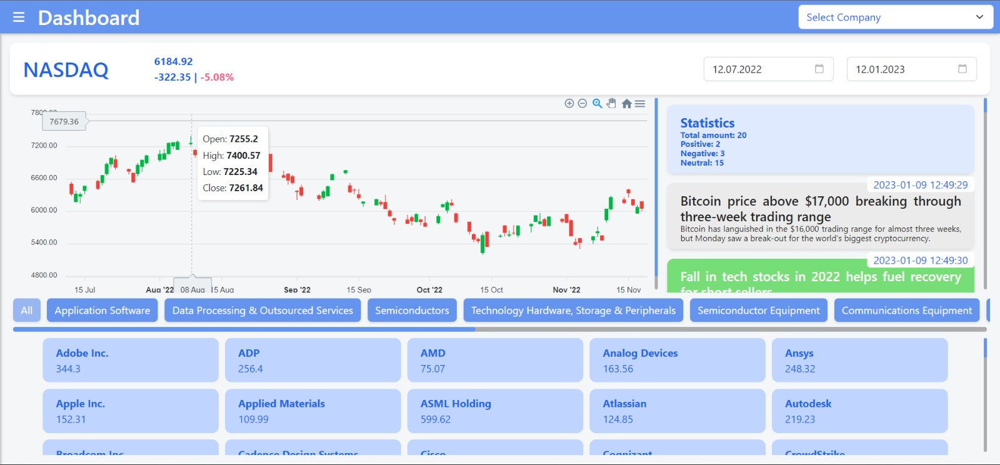
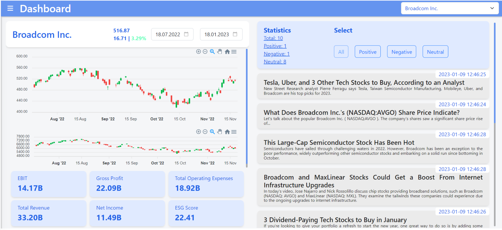

# 22-23_sem1_bd1_team_3

# Stock Data Dashboard

A web-based dashboard to explore NASDAQ-100 technology sector index data, company KPIs, and
related financial news.


## Project Overview

The dashboard helps managers monitor the current market situation, compare their company’s performance to competitors, and explore forecasts of future stock prices.  
The goal is to support **descriptive, prescriptive, and predictive** analysis through intuitive graphs, KPIs, news, and sentiment views.

Our pipeline consists of six main parts:

1. Data Collection  
2. Data Streaming  
3. Data Processing  
4. Data Storage  
5. API Layer  
6. Data Visualization (Dashboard)  

---

## Architecture & Pipeline

```text
Data Sources (Yahoo Finance)
        ↓
Apache Kafka (Streaming Platform)
        ↓
Apache Spark (Processing & ML for stock prediction)
        ↓
MongoDB (Non-relational storage, Docker/Kubernetes)
        ↓
REST API (Python)
        ↓
React Dashboard (Plotly-based visualizations)
```


## Screenshots



## Contributors
Anh Thu Bui, Ivan Osipchyk, Tobias Henning, Ismail, Max, Akila

This dashboard originated as the Big Data course project during my exchange semester at HVA Amsterdam.  
It was implemented as a collaborative team project, with shared responsibility for backend, data engineering, and frontend components (see user guide and project definition),


